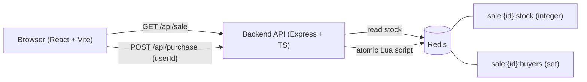
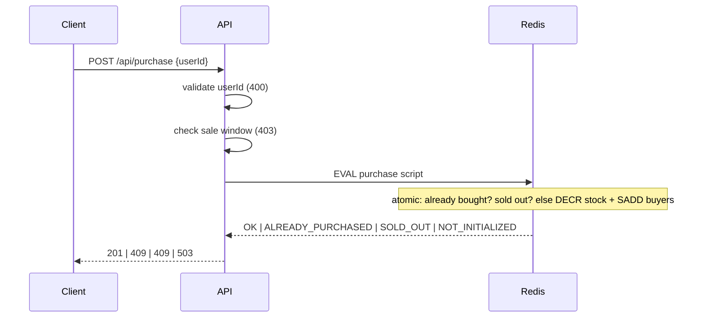

# High-Throughput Flash Sale System

Backend + frontend for a flash sale: limited stock, one purchase per user, configurable sale window, race-condition-safe under concurrent load.

## Layout

- `backend/` — Node.js + TypeScript + Express API, backed by Redis
- `frontend/` — React + TypeScript (Vite)
- `docker-compose.yml` — local Redis

## Getting started

Prerequisites: Node.js 22 (developed on 22.19) and Docker.

```bash
# 1. Start Redis
docker compose up -d

# 2. Backend (terminal 1) - http://localhost:4000
cd backend
npm install
npm run dev

# 3. Frontend (terminal 2) - open the URL Vite prints, usually http://localhost:5173
cd frontend
npm install
npm run dev
```

The frontend proxies `/api` to the backend on port 4000. No configuration is required. Without a `.env` file the backend sells 100 items in a window that starts one minute before the backend starts and lasts 24 hours. To change this, copy `backend/.env.example` to `backend/.env` and edit it (the example window runs from 2026 to 2030, and it must include the current time for purchases to succeed).

To reset the sale to a clean state: `docker compose down && docker compose up -d`, then restart the backend so it seeds the stock again.

## API

### `GET /api/sale`

Returns the sale config, remaining stock (read from Redis), and window status (`upcoming` | `active` | `ended`).

### `POST /api/purchase`

Request body: `{ "userId": "string" }`

Checks run in this order: validate `userId`, check the sale window, then an atomic Redis Lua script (stock check + one-per-user check + decrement, as a single step).

| Case | Status | Body |
|---|---|---|
| Purchased | `201` | `{ "status": "purchased", "saleId", "userId" }` |
| `userId` missing or not a string | `400` | `{ "error": "INVALID_USER_ID" }` |
| Sale not started | `403` | `{ "error": "SALE_NOT_STARTED" }` |
| Sale ended | `403` | `{ "error": "SALE_ENDED" }` |
| User already purchased | `409` | `{ "error": "ALREADY_PURCHASED" }` |
| Sold out | `409` | `{ "error": "SOLD_OUT" }` |
| Stock key missing (sale not seeded) | `503` | `{ "error": "SALE_NOT_INITIALIZED" }` |
| Malformed JSON body | `400` | `{ "error": "INVALID_JSON" }` |
| Body larger than 100 KB | `413` | `{ "error": "PAYLOAD_TOO_LARGE" }` |
| Redis unreachable, failing, or slower than 2 s | `503` | `{ "error": "SERVICE_UNAVAILABLE" }` |
| Unexpected bug in the API | `500` | `{ "error": "INTERNAL_ERROR" }` |

If a user has already purchased and stock is also exhausted, `ALREADY_PURCHASED` wins.

The sale window is half-open: `[startsAt, endsAt)`. A purchase at exactly `startsAt` is allowed; at exactly `endsAt` it is rejected as `SALE_ENDED`.

## Architecture



### Purchase flow



## Design & Trade-offs

- **Concurrency control:** The main risk is the check-then-act race: two requests can read `stock = 1` before either decrements it. This is solved by a Lua script that checks the buyer and the stock, then decrements the stock and records the buyer as one atomic step. Redis runs the script one at a time, so every timing is equal to some sequential order, and no oversell or double purchase is possible. The cost is that correctness depends on a single Redis instance.
- **Alternatives considered:** `WATCH`/`MULTI` retries under contention, and requires the client to arrange the transaction via multiple network round trips and handle potential failures, whereas the Lua script runs entirely on the Redis server in a single, block-free pass. There is also a distributed lock, but this adds network latency, which contradicts the very requirement this flash sale is built for: to be fast but reliable. Another option is a database row lock, but if a lock is held open too long, this degrades throughput and could eventually trigger a deadlock.
- **Where state lives:** Redis only, since this gives us speed and simplicity. There is no durable record of purchases.
- **Durability:** Redis keeps everything in memory, so a restart with no persistence wipes stock and buyers, and `seedStock` can then silently oversell. This project does not configure persistence anywhere. If AOF were enabled, `appendfsync everysec` would be the sensible choice: it processes writes fast enough, with a loss window of only about one second. `appendfsync always` is the safest option, but at the cost of being the slowest of the three. The last one, `appendfsync no`, is the fastest, but Redis then depends on the operating system's own flush schedule by default, which has a potential loss of around 30 seconds.
- **Scaling:** The test reached about 3,000 req/s, but it ran on the same machine as the server, so this is purely indicative. The API is stateless, so it can run as multiple instances. Under heavier load, the Node process would most likely be the first to break, then Redis itself, since it only runs a few commands. The real limit is that every request hits the same two keys, so Redis Cluster would not spread this load. The fix would be to shard the stock across several keys.
- **Known limitations:** The project only uses a single Redis instance, so the design will not survive a Redis failure or restart. The user ID is not authenticated at all, so any client can supply someone else's ID and purchase as them. The countdown uses the client's clock instead of the server's, for simplicity, even though the server always makes the real decision. The load test ran on the same machine as the server, so the throughput number is still noisy. There is also no rate limiting, so a single client could exhaust the sale by itself. A purchase that times out has an unknown outcome to the client, but retrying is safe, since a second attempt returns `ALREADY_PURCHASED` and never takes the stock twice.

## Testing

### Automated tests

Requires Redis running (`docker compose up -d`). Tests use Redis database 15, so local dev data in database 0 is not touched.

```bash
cd backend
npm test
```

- **Integration tests:** validation, sale window boundaries (`startsAt` inclusive, `endsAt` exclusive), purchase logic, duplicates, sold out, missing stock key.
- **Concurrency tests:** the three stress scenarios below, run through HTTP, plus a 10-round repeat of the contested-stock case.
- **Negative controls:** a naive check-then-act implementation, given the same load through the same HTTP path, oversells and lets one user buy many times. This shows the tests can fail, so the passing Lua version is meaningful.

### Stress test

A separate process sends load to a running backend. Start Redis and the backend first.

```bash
docker compose up -d
cd backend
npm run dev        # terminal 1
npm run stress     # terminal 2
```

`npm run stress` resets Redis database 0 before each scenario, so it wipes local dev data. It also intentionally leaves the sale sold out afterward, since the last scenario's correct result is `stock = 0`. Reset before demoing the UI with `docker compose down && docker compose up -d` (no volume is used, so this fully clears Redis), then restart the backend so it re-seeds stock.

| # | Scenario | Expected result |
|---|---|---|
| 1 | 1000 distinct users, stock 100 | exactly 100 x `201`, 900 x `409`, stock 0 |
| 2 | 1 user x 200 requests, stock 100 | exactly 1 x `201`, 199 x `409`, stock 99 |
| 3 | 500 users x 3 requests, stock 50 | exactly 50 x `201`, stock 0 |

Invariants checked after every scenario: created = stock drop = size of the buyers set, stock never negative, only `201` and `409` returned. The script exits with code 1 if any invariant fails.

Sample run on a local Windows machine (Docker Redis, generator on the same machine, 100 connections):

| Scenario | Throughput | p50 | p95 |
|---|---|---|---|
| 1 | about 2,850 req/s | 208 ms | 320 ms |
| 2 | about 3,290 req/s | 39 ms | 57 ms |
| 3 | about 3,960 req/s | 214 ms | 342 ms |

Read these numbers with care. The generator shares the machine with the server, so throughput is indicative only. Latency includes time spent waiting for one of the 100 client sockets during the burst, so it reflects queueing under load, not per-request service time. The claim this test supports is correctness (all invariants held), not a performance guarantee.
