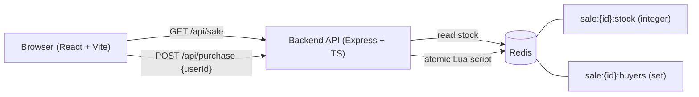
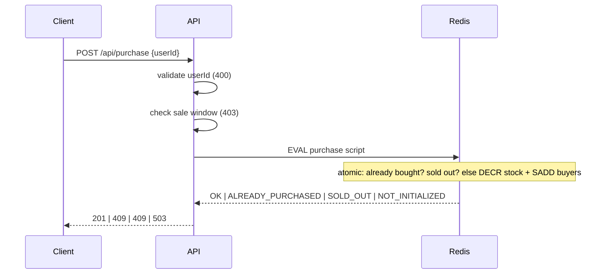

# High-Throughput Flash Sale System

Backend + frontend for a flash sale: limited stock, one purchase per user, configurable sale window, race-condition-safe under concurrent load.

Status: scaffolding in progress. Design write-up, architecture diagram, run instructions, and stress test results land here once the core purchase flow is implemented.

## Layout

- `backend/` — Node.js + TypeScript + Express API, backed by Redis
- `frontend/` — React + TypeScript (Vite)
- `docker-compose.yml` — local Redis

## API

### `GET /api/sale`

Returns the sale config, remaining stock (read from Redis), and window status (`upcoming` | `active` | `ended`).

### `POST /api/purchase`

Request body: `{ "userId": "string" }`

Checks run in this order: validate `userId`, check the sale window, then an atomic Redis Lua script (stock check + one-per-user check + decrement, as a single step).

| Case | Status | Body |
|---|---|---|
| Purchased | `201` | `{ "status": "purchased", "saleId", "userId" }` |
| `userId` missing or not a string | `400` | `{ "error": "INVALID_USER_ID" }` |
| Sale not started | `403` | `{ "error": "SALE_NOT_STARTED" }` |
| Sale ended | `403` | `{ "error": "SALE_ENDED" }` |
| User already purchased | `409` | `{ "error": "ALREADY_PURCHASED" }` |
| Sold out | `409` | `{ "error": "SOLD_OUT" }` |
| Stock key missing (sale not seeded) | `503` | `{ "error": "SALE_NOT_INITIALIZED" }` |

If a user has already purchased and stock is also exhausted, `ALREADY_PURCHASED` wins.

The sale window is half-open: `[startsAt, endsAt)`. A purchase at exactly `startsAt` is allowed; at exactly `endsAt` it is rejected as `SALE_ENDED`.

## Architecture

### Purchase flow

## Design & Trade-offs

_Outline only; to be written in my own words once the implementation is done._

- **Concurrency control:** why a single atomic Lua script (check-then-act as one step)
- **Alternatives considered:** `WATCH`/`MULTI`, distributed lock, database row lock, and why each was not chosen
- **Where state lives:** Redis only; no separate database
- **Durability:** what is lost if Redis dies without persistence, and how it could be mitigated (AOF, queue to a database)
- **Scaling:** single Redis instance vs cluster (key hash slots), queue-based fulfilment as a later step
- **Known limitations:** stated honestly

## Testing

_To be filled in: unit tests, integration tests against real Redis, and the stress test scenarios with their results._
