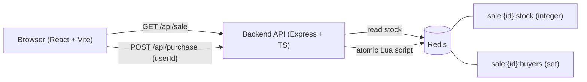
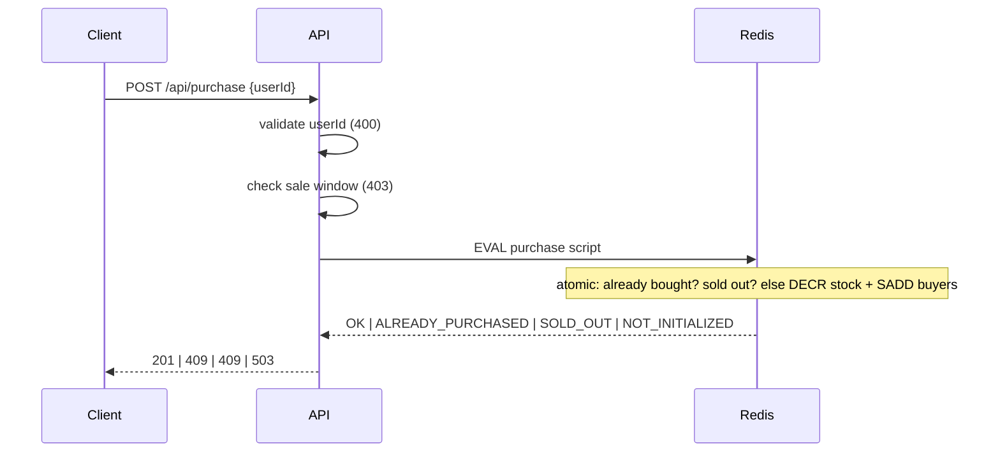

# High-Throughput Flash Sale System

Backend + frontend for a flash sale: limited stock, one purchase per user, configurable sale window, race-condition-safe under concurrent load.

Status: scaffolding in progress. Design write-up, architecture diagram, run instructions, and stress test results land here once the core purchase flow is implemented.

## Layout

- `backend/` — Node.js + TypeScript + Express API, backed by Redis
- `frontend/` — React + TypeScript (Vite)
- `docker-compose.yml` — local Redis

## API

### `GET /api/sale`

Returns the sale config, remaining stock (read from Redis), and window status (`upcoming` | `active` | `ended`).

### `POST /api/purchase`

Request body: `{ "userId": "string" }`

Checks run in this order: validate `userId`, check the sale window, then an atomic Redis Lua script (stock check + one-per-user check + decrement, as a single step).

| Case | Status | Body |
|---|---|---|
| Purchased | `201` | `{ "status": "purchased", "saleId", "userId" }` |
| `userId` missing or not a string | `400` | `{ "error": "INVALID_USER_ID" }` |
| Sale not started | `403` | `{ "error": "SALE_NOT_STARTED" }` |
| Sale ended | `403` | `{ "error": "SALE_ENDED" }` |
| User already purchased | `409` | `{ "error": "ALREADY_PURCHASED" }` |
| Sold out | `409` | `{ "error": "SOLD_OUT" }` |
| Stock key missing (sale not seeded) | `503` | `{ "error": "SALE_NOT_INITIALIZED" }` |

If a user has already purchased and stock is also exhausted, `ALREADY_PURCHASED` wins.

The sale window is half-open: `[startsAt, endsAt)`. A purchase at exactly `startsAt` is allowed; at exactly `endsAt` it is rejected as `SALE_ENDED`.

## Architecture



### Purchase flow



## Design & Trade-offs

_Outline only; to be written in my own words once the implementation is done._

- **Concurrency control:** why a single atomic Lua script (check-then-act as one step)
- **Alternatives considered:** `WATCH`/`MULTI`, distributed lock, database row lock, and why each was not chosen
- **Where state lives:** Redis only; no separate database
- **Durability:** what is lost if Redis dies without persistence, and how it could be mitigated (AOF, queue to a database)
- **Scaling:** single Redis instance vs cluster (key hash slots), queue-based fulfilment as a later step
- **Known limitations:** stated honestly

## Testing

### Automated tests

Requires Redis running (`docker compose up -d`). Tests use Redis database 15, so local dev data in database 0 is not touched.

```bash
cd backend
npm test
```

- **Integration tests:** validation, sale window boundaries (`startsAt` inclusive, `endsAt` exclusive), purchase logic, duplicates, sold out, missing stock key.
- **Concurrency tests:** the three stress scenarios below, run through HTTP, plus a 10-round repeat of the contested-stock case.
- **Negative controls:** a naive check-then-act implementation, given the same load through the same HTTP path, oversells and lets one user buy many times. This shows the tests can fail, so the passing Lua version is meaningful.

### Stress test

A separate process sends load to a running backend. Start Redis and the backend first.

```bash
docker compose up -d
cd backend
npm run dev        # terminal 1
npm run stress     # terminal 2
```

`npm run stress` resets Redis database 0 before each scenario, so it wipes local dev data.

| # | Scenario | Expected result |
|---|---|---|
| 1 | 1000 distinct users, stock 100 | exactly 100 x `201`, 900 x `409`, stock 0 |
| 2 | 1 user x 200 requests, stock 100 | exactly 1 x `201`, 199 x `409`, stock 99 |
| 3 | 500 users x 3 requests, stock 50 | exactly 50 x `201`, stock 0 |

Invariants checked after every scenario: created = stock drop = size of the buyers set, stock never negative, only `201` and `409` returned. The script exits with code 1 if any invariant fails.

Sample run on a local Windows machine (Docker Redis, generator on the same machine, 100 connections):

| Scenario | Throughput | p50 | p95 |
|---|---|---|---|
| 1 | about 2,850 req/s | 208 ms | 320 ms |
| 2 | about 3,290 req/s | 39 ms | 57 ms |
| 3 | about 3,960 req/s | 214 ms | 342 ms |

Read these numbers with care. The generator shares the machine with the server, so throughput is indicative only. Latency includes time spent waiting for one of the 100 client sockets during the burst, so it reflects queueing under load, not per-request service time. The claim this test supports is correctness (all invariants held), not a performance guarantee.
